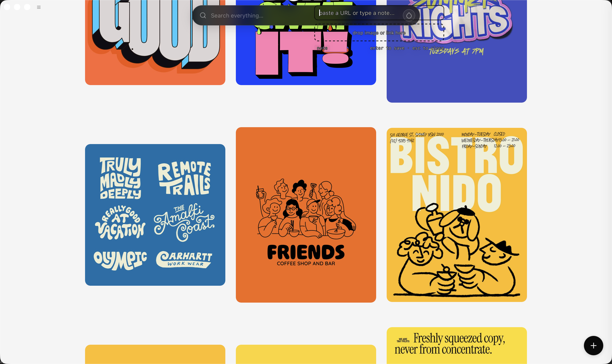

# kure-tauri

`kure-tauri` is the standalone Tauri desktop app for Stash.

This repo is the clean split from the older Electron-based desktop codebase. It keeps the current app shell, packaging flow, and desktop bridge in one place so releases and CI can stay focused on the Tauri app only.



## What’s inside

- React + Vite desktop UI
- Tauri macOS shell and native window/tray wiring
- Node bridge for vault access, metadata fetches, search, AI enrichment, and media workflows
- DMG packaging for local installs and GitHub releases

## Local development

Requirements:

- Node.js 22+
- Rust stable
- macOS 11+

Install dependencies:

```bash
npm install
```

Run the desktop app in development:

```bash
npm run dev
```

Run the web shell only:

```bash
npm run dev:tauri
```

## Build and package

Build the desktop app:

```bash
npm run build:tauri
```

Create an installable DMG:

```bash
npm run package:dmg
```

The packaged installer lands in:

`src-tauri/target/release/bundle/dmg/`

## CI and releases

- Pull requests and pushes to `main` run the desktop validation workflow in GitHub Actions.
- Pushing a version tag like `v1.0.1` triggers the macOS DMG release workflow.

Release flow:

```bash
git tag v1.0.1
git push origin v1.0.1
```

That workflow uploads the DMG and checksum file to the GitHub release for the tag.
